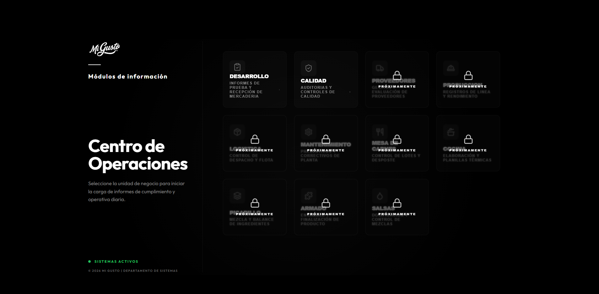
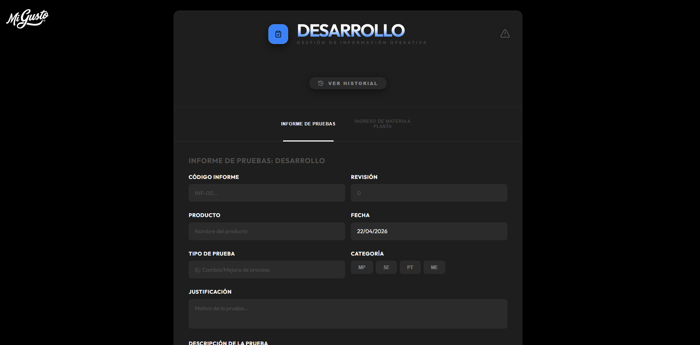
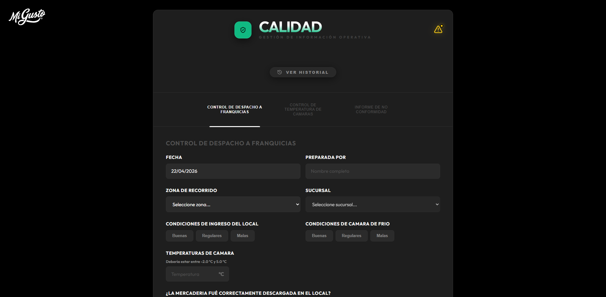

  
  <h1>ActivityRegs System</h1>
  
<strong>Gestión y Digitalización de Procesos Industriales</strong>

  
  
  
  

---

## 🌟 Visión General

**ActivityRegs System** es una plataforma avanzada diseñada para la centralización y digitalización de registros operativos en entornos de fabricación. Orientada a la eficiencia y la trazabilidad, permite a los diferentes departamentos de **Mi Gusto** gestionar informes de calidad, desarrollo de productos, logística y controles térmicos en tiempo real.

Con una interfaz moderna, oscura y minimalista, el sistema prioriza la experiencia de usuario y la integridad de los datos, eliminando la dependencia del papel y optimizando la comunicación interdepartamental.

---

## 📸 Interfaz del Sistema

### 🕹️ Centro de Operaciones
El núcleo del sistema permite el acceso rápido a los diferentes módulos operativos. Cada sector cuenta con su propio ecosistema de formularios y herramientas especializadas.

  

### 🧪 Módulo de Desarrollo
Gestión integral de informes de prueba, recepción de mercadería y trazabilidad de insumos. Permite documentar cada fase del proceso creativo y técnico de nuevos productos.

  

### 🛡️ Módulo de Calidad
Control riguroso de despachos a franquicias, auditorías internas y seguimiento de no conformidades con comunicación directa entre áreas.

  

---

## 🚀 Características Principales

- **📊 Dashboard Multidisciplinario**: Módulos específicos para Desarrollo, Calidad, Logística, Producción y más.
- **⚡ Sincronización en Tiempo Real**: Base de datos reactiva mediante **Supabase** para una actualización instantánea entre dispositivos.
- **📄 Generación de Reportes PDF**: Exportación profesional de informes con formato listo para auditorías.
- **📍 Geolocalización Inteligente**: Detección automática de ubicación para controles de temperatura en planta y camiones.
- **💬 Sistema de Notificaciones**: Flujo de comunicación integrado para la resolución de no conformidades.
- **🔐 Seguridad y Control**: Acceso restringido mediante PIN administrativo para funciones críticas.

---

## 🛠️ Tecnologías Utilizadas

- **Frontend**: React 18, Vite, Framer Motion (Animaciones).
- **Backend & DB**: Supabase (PostgreSQL + Realtime).
- **UI/UX**: Tailwind CSS (Custom styles), Lucide Icons.
- **Utilidades**: html2pdf.js, React Router 6.

---

  
<i>Desarrollado por el Departamento de Sistemas - Mi Gusto © 2026</i>

