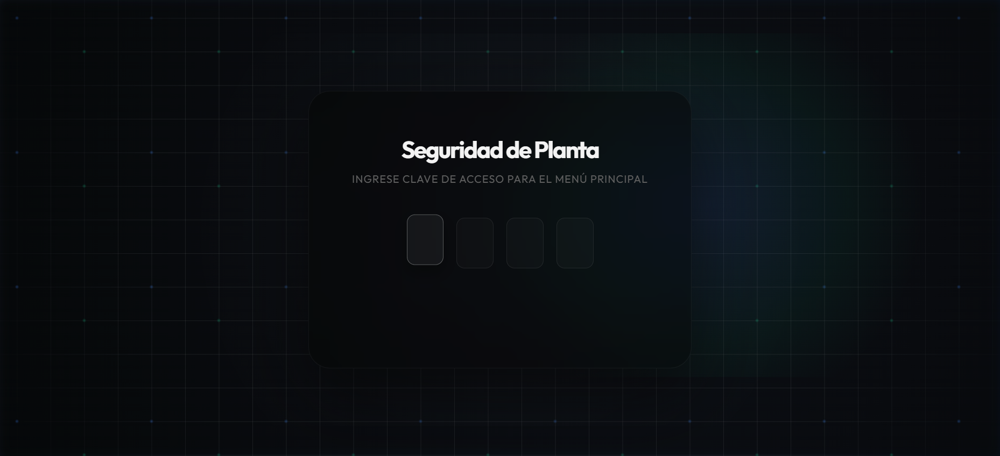
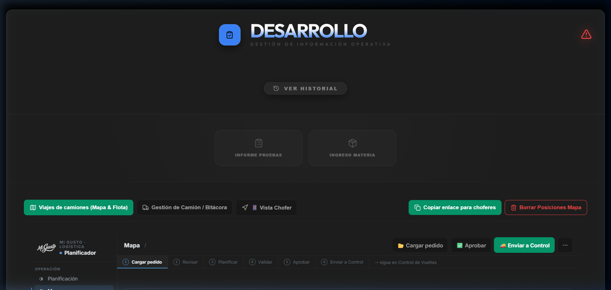
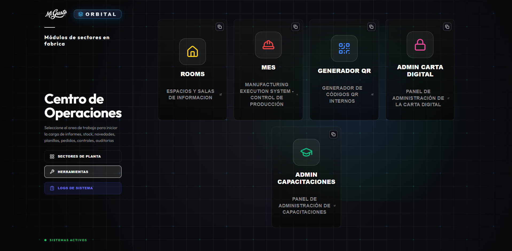
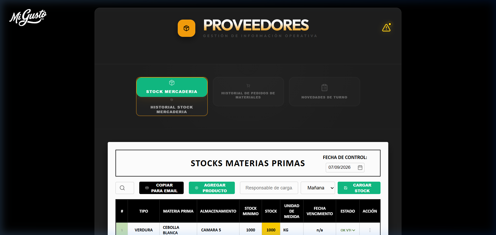

# 🏭 ActivityRegs System

  
  

    <strong>Ecosistema de Gestión y Digitalización Industrial para "Mi Gusto"</strong>
  

  

    Una solución robusta diseñada para la trazabilidad total, la eliminación del papel y la optimización de procesos en tiempo real.
  

---

## 💎 Visión Premium

**ActivityRegs System** no es solo un gestor de registros; es el núcleo operativo digital de la planta. Diseñado bajo una estética **Dark Minimalist**, el sistema ofrece una interfaz intuitiva que reduce la fricción operativa y garantiza que cada dato crítico —desde temperaturas de cámara hasta controles de calidad— sea capturado con precisión quirúrgica.

Priorizamos la **integridad de los datos** y la **velocidad de respuesta**, transformando procesos analógicos complejos en flujos de trabajo digitales fluidos y automatizados.

---

## 🎨 Galería de Interfaz

Explora la experiencia visual del sistema. Una interfaz diseñada para la claridad y la eficiencia en entornos de alta exigencia.

  <table style="border: none;">
    <tr>
      <td align="center" style="border: none;">
        
<b>Centro de Operaciones</b>

        
      </td>
      <td align="center" style="border: none;">
        
<b>Sectores de planta</b>

        
      </td>
    </tr>
    <tr>
      <td align="center" style="border: none;">
        
<b>Herramientas</b>

        
      </td>
      <td align="center" style="border: none;">
        
<b>Logs de sistema</b>

        
      </td>
    </tr>
  </table>

---

## ⚡ Capacidades Core

- **📊 Ecosistema Modular**: Departamentos integrados: Desarrollo, Calidad, Logística, Producción, Mesa de Carnes, Cocina y más.
- **🔄 Sincronización Reactiva**: Actualizaciones instantáneas en todos los dispositivos mediante la infraestructura de **Supabase Realtime**.
- **📜 Documentación Automatizada**: Motor de generación de reportes PDF profesionales listos para auditorías externas.
- **📍 Geolocalización Estratégica**: Detección inteligente de ubicación para validación de controles en planta y logística.
- **🛡️ Seguridad Administrativa**: Control de acceso granular mediante PIN para la protección de operaciones críticas.
- **💬 Chat de Resolución**: Sistema de comunicación integrado para el seguimiento y cierre de No Conformidades.

---

## 🛠️ Stack Tecnológico de Vanguardia

- **Core**: [React 18](https://reactjs.org/) con [Vite](https://vitejs.dev/) para un rendimiento ultrarrápido.
- **Animaciones**: [Framer Motion](https://www.framer.com/motion/) para transiciones orgánicas y fluidas.
- **Base de Datos**: [Supabase](https://supabase.com/) (PostgreSQL) con suscripciones en tiempo real.
- **Estilos**: [Tailwind CSS](https://tailwindcss.com/) con configuraciones personalizadas para el modo oscuro.
- **Iconografía**: [Lucide React](https://lucide.dev/) para una semántica visual clara.

---

  
<i>Impulsando la excelencia operativa en Mi Gusto.</i>

  
<b>Departamento de Sistemas © 2026</b>

